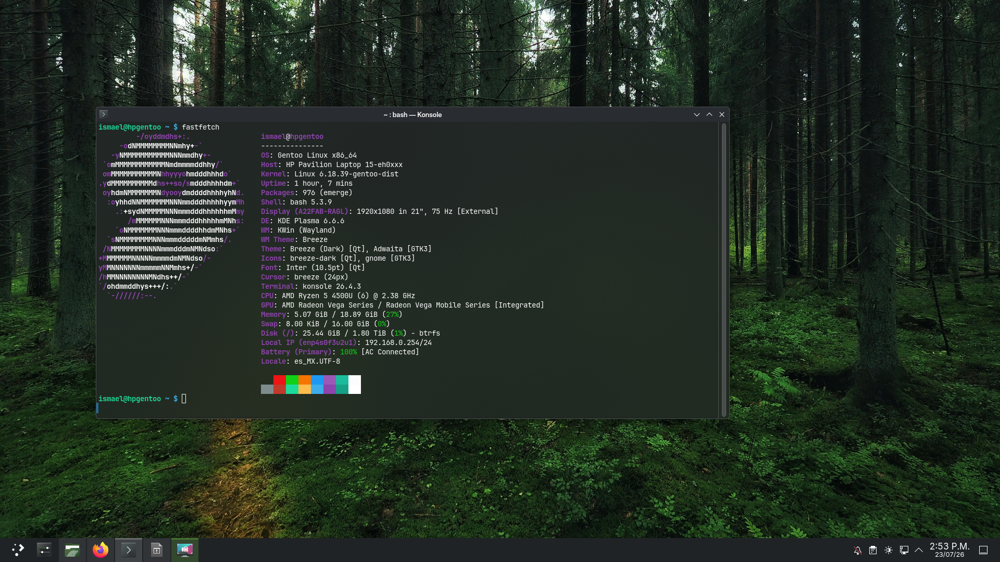

# Gentoo-HP

Perfil de instalacion de Gentoo para una **HP Pavilion Laptop 15-eh0xxx** con Ryzen 5 4500U.

Este proyecto esta basado explicitamente en el repositorio original
[oddlama/gentoo-install](https://github.com/oddlama/gentoo-install).
Sobre esa base se agrego un perfil automatizado y ajustado para este hardware:

La arquitectura interna y el registro de fixes están documentados en
[`docs/FUNCIONAMIENTO-Y-FIXES.md`](docs/FUNCIONAMIENTO-Y-FIXES.md).
La pila multimedia y su diagnóstico están explicados en
[`docs/AUDIO-Y-BLUETOOTH.md`](docs/AUDIO-Y-BLUETOOTH.md).

- CPU AMD Ryzen 5 4500U / Renoir, usando `-march=znver2`
- GPU AMD Radeon Vega integrada, usando `VIDEO_CARDS="amdgpu radeonsi"`
- Wi-Fi Intel Wi-Fi 6 AX200
- Disco NVMe
- Gentoo `amd64` con `systemd`
- Kernel compilado localmente con `sys-kernel/gentoo-kernel`
- Root en Btrfs con LUKS
- Dracut persistente con carga temprana de `nvme` y `amdgpu`
- NetworkManager + iwd para Wi-Fi
- Aceleracion AMD Renoir/Vega con Mesa, RadeonSI, RADV, VA-API, VDPAU y Vulkan
- SDDM como gestor de inicio de sesion
- KDE Plasma instalado con soporte Wayland
- Dolphin, Konsole, Discover y Ark con soporte ZIP/7-Zip/RAR
- Flatpak integrado con Discover y el remoto Flathub configurado
- Fastfetch para mostrar informacion del sistema
- Firefox precompilado mediante `www-client/firefox-bin`
- PipeWire + WirePlumber con ALSA, compatibilidad Pulse y RTKit
- BlueZ habilitado para el Intel AX200, Bluedevil y audio Bluetooth
- Sway como entorno grafico Wayland
- foot, waybar, wofi, mako, swaylock, swayidle y wl-clipboard
- Teclado `latam` y touchpad con tap/natural scroll en Sway
- TLP con soporte `ppd`, habilitando `tlp.service` y `tlp-pd.service`
- Fuentes Noto, Noto CJK y Noto Color Emoji para emojis y caracteres asiaticos
- `.bashrc` preparado con rutas personales, `opencode`, `NO_AT_BRIDGE` y Bash interactivo comodo
- Carpetas personales XDG en español para KDE, Dolphin, Firefox y Flatpak
- Instalacion automatica al unico NVMe detectado
- Arranque UEFI obligatorio, sin modo BIOS
- GRUB UEFI con tema Zorin extraido para el menu de arranque
- Usuario normal preguntado durante la instalacion, con `sudo` opcional

## Captura



## Advertencia Importante

La configuracion incluida esta pensada para instalar Gentoo usando un disco completo.

El modo por defecto es:

```bash
TARGET_DISK="auto-nvme"
```

Eso significa que el instalador buscara automaticamente un disco `/dev/nvme*n*` y lo usara como destino. Para evitar accidentes, solo continua si encuentra exactamente un NVMe. Si encuentra cero o mas de uno, se detiene.

Si ejecutas esto antes de cambiar el NVMe, y el unico NVMe es el de Fedora, el instalador va a borrar Fedora. Cambia fisicamente al NVMe nuevo antes de correr `./install`.

El perfil es UEFI-only. Si arrancas el USB en modo legacy/BIOS, aborta.

Este perfil no configura Secure Boot ni firma el kernel o GRUB. Desactiva Secure Boot en el firmware antes de intentar arrancar el sistema instalado.

El archivo `gentoo.conf` ya viene desbloqueado para el modo automatico:

```bash
I_HAVE_READ_AND_EDITED_THE_CONFIG_PROPERLY=true
```

Aunque este desbloqueado, el instalador todavia muestra el layout antes de particionar. Confirma solo si el NVMe mostrado es el correcto.

## Usuario

Por seguridad, `gentoo.conf` no guarda ningun nombre de usuario ni contrasena.

Durante la instalacion el script pregunta:

```text
Nombre del usuario normal que quieres crear:
Quieres que '<usuario>' sea administrador con sudo (grupo wheel)?
Define la contrasena para el usuario '<usuario>'
```

Si respondes que si al acceso de administrador, el usuario queda en `wheel` y puede usar `sudo`. No se crea como UID 0, no queda como `root` directo y no tiene sudo sin contrasena. Cuando uses comandos administrativos, Gentoo pedira la contrasena del usuario:

```bash
sudo emerge --sync
sudo emerge --ask app-editors/neovim
```

Si respondes que no, el usuario queda normal, sin `sudo`. En ese caso conviene responder que si cuando el instalador pregunte por la contrasena de `root`, porque necesitaras root para administrar el sistema.

El modo recomendable para una laptop personal es usuario normal para el dia a dia, `sudo` con contrasena para tareas de administrador, y root solo cuando haga falta.

## Ya Tengo El USB LiveGUI, Ahora Que Hago

Si Fedora Media Writer ya termino de grabar `livegui-amd64-...iso`, no necesitas montar el USB desde Fedora. Lo que sigue es reiniciar y arrancar desde ese USB.

1. Reinicia la laptop.
2. En HP normalmente entra al menu de arranque con `Esc` y luego `F9`.
3. Elige el USB en modo UEFI.
4. Entra al entorno LiveGUI de Gentoo.
5. Conectate a internet desde la interfaz grafica o por cable.
6. Abre una terminal.

En la terminal entra como root:

```bash
sudo -i
```

Si ya estas como root, puedes seguir.

## Clonar Este Repositorio

Primero verifica que tengas internet:

```bash
ping -c 3 gentoo.org
```

Si `git` no viene instalado en el LiveGUI, instalalo asi:

```bash
sudo -i
emerge --sync
emerge --ask dev-vcs/git
```

Si `emerge --sync` tarda demasiado o falla por no tener arbol de Portage listo, usa esta variante:

```bash
sudo -i
emerge-webrsync
emerge --ask dev-vcs/git
```

Cuando `git` ya exista, clona el repositorio:

```bash
git clone https://github.com/isgaar/Gentoo-HP.git
cd Gentoo-HP
```

## Encontrar El Disco Correcto

Antes de instalar, identifica el disco. Si ya cambiaste el NVMe, deberia aparecer el nuevo disco como algo similar a:

```text
/dev/nvme0n1  MODELO_DEL_NVME_NUEVO
```

En el LiveGUI revisalo:

```bash
lsblk -o NAME,MODEL,SIZE,TYPE,FSTYPE,MOUNTPOINTS
ls -l /dev/disk/by-id/
```

Si solo hay un NVMe, no tienes que editar `TARGET_DISK`; el instalador lo detecta solo.

Si hay mas de un NVMe, el modo automatico se detiene. En ese caso edita `gentoo.conf` y cambia `TARGET_DISK="auto-nvme"` por el disco exacto, por ejemplo `TARGET_DISK="/dev/nvme0n1"`.

## Revisar La Configuracion

Normalmente ya no tienes que editar `gentoo.conf` para el disco. Aun asi, puedes revisarlo:

Abre `gentoo.conf`:

```bash
nano gentoo.conf
```

El modo rapido es:

```bash
TARGET_DISK="auto-nvme"
```

El perfil tambien viene listo para UEFI:

```bash
create_classic_single_disk_layout swap=16GiB type=efi luks=true root_fs=btrfs "$TARGET_DISK"
```

El sistema raiz no usa ext4. Se crea Btrfs dentro de LUKS con un unico subvolumen `root`, montado como `/`; no se crean subvolumenes separados para `/home`, `/var` ni snapshots.

Revisa tambien:

```bash
KEYMAP="la-latin1"
TIMEZONE="America/Mexico_City"
LOCALE="es_MX.UTF-8"
```

Si tu contrasena de cifrado va a tener simbolos raros, conviene usar una frase larga con letras y numeros para evitar problemas de teclado en el arranque.

## Instalar

Puedes dejar que el instalador te pregunte la contrasena LUKS, o definirla antes:

```bash
export GENTOO_INSTALL_ENCRYPTION_KEY="una frase larga y segura"
```

Despues ejecuta:

```bash
./install
```

El instalador va a mostrar el layout de disco antes de hacer cambios. Lee esa pantalla con calma. Debe decir que usara el NVMe nuevo. Si ves el disco equivocado, cancela.

Cuando confirmes, hara en resumen:

1. Verificar que arrancaste en UEFI.
2. Detectar automaticamente el unico NVMe.
3. Particionar el NVMe en modo EFI.
4. Crear swap de 16 GiB.
5. Crear root Btrfs cifrado con LUKS.
6. Descargar y extraer stage3 `amd64-systemd`.
7. Configurar Portage para Ryzen 5 4500U y Radeon Vega.
8. Compilar kernel Gentoo desde fuente.
9. Instalar firmware, NetworkManager, iwd, SDDM, KDE Plasma, Sway, TLP, `tlp-pd`, PipeWire, WirePlumber, BlueZ, Dolphin, Konsole, Discover, Flatpak, Fastfetch, Ark y herramientas de compresion.
10. Crear una configuracion persistente de Dracut con soporte temprano para `amdgpu` y `nvme`.
11. Crear entrada EFI para arrancar Gentoo y configurar GRUB UEFI con tema personalizado.
12. Preguntar el usuario normal, pedir su contrasena y preguntar si tendra `sudo`.
13. Crear su `.bashrc` con rutas personales, `opencode`, `NO_AT_BRIDGE`, `.bashrc.d` y completado sin distinguir mayusculas.
14. Configurar aceleracion de video para Radeon Vega: Mesa/RadeonSI/RADV, VA-API, VDPAU, Vulkan, FFmpeg, GStreamer y mpv.
15. Configurar fuentes Unicode para emojis y caracteres CJK.
16. Crear configuracion basica de Sway y las carpetas personales XDG en español.
17. Corregir recursivamente el propietario de su directorio personal y habilitar `sddm`.
18. Instalar Firefox como binario generico para evitar su compilacion local.

## Primer Arranque

Cuando termine:

```bash
reboot
```

Retira el USB o elige el disco interno desde el menu UEFI.

Al arrancar Gentoo te pedira la contrasena LUKS. Despues aparecera SDDM.

Inicia sesion con el usuario y la contrasena que definiste durante la instalacion. En el selector de sesion de SDDM podras elegir KDE Plasma o Sway. Si quieres el escritorio completo, elige Plasma. Si quieres un entorno ligero tipo tiling, elige Sway.

Atajos iniciales en Sway:

- `Super + Enter`: abrir terminal `foot`
- `Super + d`: abrir launcher `wofi`
- `Super + Shift + q`: cerrar ventana
- `Super + Shift + c`: recargar configuracion
- `Super + Shift + e`: salir de Sway
- `Print`: seleccionar region y copiar captura al portapapeles

El menu de arranque sera GRUB UEFI con el tema Zorin extraido. El instalador instala el tema en:

```text
/boot/efi/grub/themes/gentoo-hp-zorin
```

Tambien escribe:

```text
/boot/efi/grub/grub.cfg
/etc/default/grub
```

El arranque principal del menu usa el kernel e initramfs que el instalador copia a la particion EFI:

```text
/boot/efi/vmlinuz.efi
/boot/efi/initramfs.img
```

Tambien instala:

```text
/etc/dracut.conf.d/90-gentoo-hp.conf
/usr/local/sbin/gentoo-hp-update-boot
/etc/kernel/postinst.d/95-gentoo-hp-esp.install
```

El hook actualiza automaticamente los dos archivos del ESP cuando `sys-kernel/gentoo-kernel` instala una version nueva. Para repetir la sincronizacion manualmente:

```bash
sudo gentoo-hp-update-boot
```

No uses `grub-mkconfig -o /boot/grub/grub.cfg` para este perfil: GRUB se instala en el ESP y carga `/boot/efi/grub/grub.cfg`, que apunta deliberadamente a los nombres fijos anteriores.

Para conectarte por Wi-Fi en consola:

```bash
nmtui
```

O con NetworkManager:

```bash
nmcli device wifi list
nmcli device wifi connect "NOMBRE_DE_TU_WIFI" password "TU_PASSWORD"
```

## Bash Del Usuario

El instalador crea `/home/<usuario>/.bashrc` con una plantilla limpia:

- carga `/etc/bash/bashrc` en Gentoo o `/etc/bashrc` si existe;
- agrega una sola vez `$HOME/.opencode/bin`, `$HOME/.local/bin` y `$HOME/bin` al `PATH`;
- exporta `NO_AT_BRIDGE=1`;
- carga archivos en `$HOME/.bashrc.d/`;
- activa completado, globbing y correcciones de `cd` sin distinguir mayusculas en shells interactivos.

Al terminar las configuraciones de KDE y Sway, el instalador ejecuta el equivalente generico de:

```bash
chown -R <usuario>:<grupo-principal> /home/<usuario>
```

Esto incluye `/home/<usuario>/.config` y evita que los archivos creados durante la instalacion queden propiedad de `root`.

## Carpetas Personales XDG

El perfil instala `x11-misc/xdg-user-dirs` y crea estas carpetas antes del primer inicio de sesion:

```text
Escritorio
Descargas
Documentos
Imágenes
Música
Vídeos
```

Tambien escribe `~/.config/user-dirs.dirs` y `~/.config/user-dirs.locale` para que KDE, Dolphin, Firefox, Flatpak y las demas aplicaciones usen esos mismos nombres. `Plantillas` y `Público` quedan desactivadas apuntando al propio directorio personal, por lo que el instalador crea exactamente las seis carpetas anteriores.

En una instalacion nueva esto evita que se generen duplicados como `Desktop`, `Downloads` o `Pictures`. Si ya existen, el instalador no los borra ni mueve porque podrian contener datos; revisa su contenido y migralo manualmente a las carpetas en español.

## Compilacion Y Paquetes Binarios

`ENABLE_BINPKG` permanece desactivado para evitar que Portage sustituya indiscriminadamente componentes centrales con paquetes del binhost.

Se compilan normalmente desde los ebuilds:

- kernel Gentoo;
- Mesa y LLVM;
- systemd y componentes base que necesiten reconstruccion;
- KDE Plasma y sus aplicaciones;
- Sway, TLP y la pila PipeWire.

Firefox es la excepcion explicita y se instala mediante `www-client/firefox-bin`. Las herramientas de escritorio añadidas son:

```text
kde-apps/ark
kde-apps/dolphin
kde-apps/konsole
kde-plasma/bluedevil
kde-plasma/discover
kde-plasma/plasma-pa
app-arch/7zip
app-arch/unrar
app-arch/unzip
app-arch/zip
app-misc/fastfetch
media-video/pipewire
media-video/wireplumber
net-wireless/bluez
sys-apps/flatpak
sys-auth/rtkit
x11-misc/xdg-user-dirs
```

Discover se compila con soporte Flatpak y el instalador registra Flathub como remoto del sistema. Tambien activa la integracion Flatpak de `xdg-desktop-portal` y PipeWire. Discover administrara aplicaciones Flatpak; las actualizaciones nativas de Gentoo siguen realizandose con Portage.

Para comprobarlo despues del primer arranque:

```bash
fastfetch
flatpak remotes
flatpak list
```

## Audio Y Bluetooth

Gentoo-HP utiliza PipeWire como servidor multimedia y WirePlumber como gestor de
sesion. PipeWire se compila con `sound-server`, `pipewire-alsa`, `bluetooth`,
`dbus` y `systemd`; tambien se instalan RTKit, `plasma-pa`, BlueZ y Bluedevil.

El instalador activa los monitores ALSA y BlueZ de WirePlumber, habilita
globalmente los servicios de usuario de PipeWire y habilita
`bluetooth.service`. Esto evita que KDE muestre solamente `Dummy Output` y
permite que el Intel AX200 busque dispositivos.

Comprobacion rapida:

```bash
wpctl status
speaker-test -c 2 -t wav -l 1
systemctl status bluetooth
bluetoothctl show
```

Consulta el diagnóstico completo y la reparación para instalaciones existentes
en [`docs/AUDIO-Y-BLUETOOTH.md`](docs/AUDIO-Y-BLUETOOTH.md).

## Aceleracion De Video AMD

El perfil esta ajustado para la GPU integrada **AMD Radeon Vega / Renoir** del Ryzen 5 4500U.

Instala y configura:

- `media-libs/mesa` con `radeonsi`, `vaapi`, `vulkan`, `opencl` y `proprietary-codecs`
- `media-libs/libva` y `media-video/libva-utils` para VA-API
- `x11-libs/libvdpau` y `x11-misc/vdpauinfo` para VDPAU
- `media-libs/vulkan-loader` y `dev-util/vulkan-tools` para Vulkan/RADV
- `media-video/ffmpeg` con `vaapi`, `vdpau`, `vulkan`, `opencl` y `opengl`
- `media-plugins/gst-plugins-vaapi` para apps que usan GStreamer
- `media-video/mpv` con aceleracion VA-API/VDPAU/Vulkan
- `x11-apps/mesa-progs` para `glxinfo`
- `x11-drivers/xf86-video-amdgpu` para Xorg/SDDM cuando use sesion X11

Tambien crea:

```text
/etc/environment.d/90-amd-renoir-gpu.conf
/etc/profile.d/90-amd-renoir-gpu.sh
```

con:

```bash
LIBVA_DRIVER_NAME=radeonsi
VDPAU_DRIVER=radeonsi
AMD_VULKAN_ICD=RADV
MESA_VK_WSI_PRESENT_MODE=mailbox
```

Para probar la aceleracion:

```bash
vainfo
vdpauinfo
vulkaninfo --summary
glxinfo -B
mpv --hwdec=auto archivo.mp4
```

## Fuentes Unicode

El perfil instala:

- `media-fonts/noto`
- `media-fonts/noto-cjk`
- `media-fonts/noto-emoji`

Tambien crea `/etc/fonts/local.conf` con preferencias para `Noto Sans`, `Noto Serif`, `Noto Sans Mono`, variantes CJK y `Noto Color Emoji`.

Esto ayuda a que KDE Plasma, Sway, terminales, navegadores y apps GTK/Qt rendericen emojis y caracteres chinos, japoneses y coreanos sin cuadros vacios.

## Despues De Instalar

Actualiza el sistema:

```bash
emerge --sync
emerge --ask --verbose --update --deep --newuse @world
```

Si la actualizacion instala un kernel nuevo, el hook sincroniza automaticamente el ESP. Puedes comprobarlo o repetirlo con:

```bash
sudo gentoo-hp-update-boot
```

Comprueba las banderas de CPU:

```bash
cpuid2cpuflags
```

El perfil ya deja estas banderas configuradas:

```bash
aes avx avx2 bmi1 bmi2 f16c fma3 mmx mmxext pclmul popcnt rdrand sha sse sse2 sse3 sse4_1 sse4_2 sse4a ssse3
```

## Recuperar El Arranque Desde LiveGUI

Estos comandos corresponden al layout predeterminado: EFI en la primera particion, swap en la segunda y LUKS/Btrfs en la tercera. Confirma siempre los nombres reales con `lsblk`; no copies `/dev/nvme0n1` a ciegas si tu disco aparece con otro nombre.

Desde el LiveGUI:

```bash
sudo -i
lsblk -f
cryptsetup open /dev/nvme0n1p3 root
mkdir -p /mnt/gentoo
mount -o subvol=/root /dev/mapper/root /mnt/gentoo
mkdir -p /mnt/gentoo/boot/efi
mount /dev/nvme0n1p1 /mnt/gentoo/boot/efi

mount -t proc /proc /mnt/gentoo/proc
mount --rbind /sys /mnt/gentoo/sys
mount --make-rslave /mnt/gentoo/sys
mount --rbind /dev /mnt/gentoo/dev
mount --make-rslave /mnt/gentoo/dev
mount --rbind /run /mnt/gentoo/run
mount --make-rslave /mnt/gentoo/run

chroot /mnt/gentoo /bin/bash
source /etc/profile
```

Dentro del `chroot`, vuelve a asegurar la configuracion persistente y reconstruye los archivos que GRUB carga realmente:

```bash
mkdir -p /etc/dracut.conf.d
cat > /etc/dracut.conf.d/90-gentoo-hp.conf <<'EOF'
hostonly="no"
ro_mnt="yes"
compress="zstd"
add_dracutmodules+=" bash crypt crypt-gpg btrfs "
force_drivers+=" amdgpu nvme "
EOF

gentoo-hp-update-boot
```

Si estás reparando una instalacion anterior que todavia no tiene `gentoo-hp-update-boot`, usa temporalmente:

```bash
kver="$(basename "$(readlink -f /usr/src/linux)")"
kver="${kver#linux-}"
kernel_file="$(find /boot -maxdepth 1 -type f \( -name 'vmlinuz-*' -o -name 'kernel-*' \) | sort -V | tail -n 1)"
dracut --force --kver "$kver" /boot/efi/initramfs.img
install -m0600 "$kernel_file" /boot/efi/vmlinuz.efi
sync /boot/efi
```

No hace falta ejecutar `grub-mkconfig`: el menu existente usa `/vmlinuz.efi` e `/initramfs.img` dentro del ESP. Sal y desmonta:

```bash
exit
umount -R /mnt/gentoo
cryptsetup close root
reboot
```

No se usa LVM en este layout, por lo que `vgchange -an` no es necesario.

## Archivos Importantes

- `gentoo.conf`: perfil listo para la HP Pavilion 15-eh0xxx.
- `contrib/dracut/90-gentoo-hp.conf`: configuracion persistente del initramfs.
- `contrib/bin/gentoo-hp-update-boot`: sincroniza kernel e initramfs con el ESP.
- `contrib/kernel/postinst.d/95-gentoo-hp-esp.install`: automatiza esa sincronizacion al actualizar el kernel.
- `contrib/grub/themes/gentoo-hp-zorin`: tema GRUB extraido desde `zoringrub`.
- `contrib/screenshot.png`: captura de Gentoo-HP ejecutando KDE Plasma y Fastfetch.
- `contrib/wireplumber/10-gentoo-hp-audio-bluetooth.conf`: activa los monitores ALSA y BlueZ.
- `docs/AUDIO-Y-BLUETOOTH.md`: funcionamiento, diagnóstico y reparación de audio/Bluetooth.
- `docs/FUNCIONAMIENTO-Y-FIXES.md`: arquitectura y registro del commit de fixes.
- `gentoo.conf.example`: ejemplo general con las variables nuevas de Portage.
- `scripts/main.sh`: aplica las optimizaciones de hardware durante la instalacion.
- `configure`: configurador generico; no guardes sobre `gentoo.conf` porque no conserva los hooks especificos de este perfil.

## Notas Sobre El Proyecto Base

Este repositorio conserva como base el instalador original
[oddlama/gentoo-install](https://github.com/oddlama/gentoo-install).
El perfil personalizado se publica en:

```text
https://github.com/isgaar/Gentoo-HP.git
```

Para ver ayuda del instalador:

```bash
./install --help
```
